<div align="center">


<h1>Network Cost Optimization Platform</h1>

<p><strong>The FinOps Command Center for Multi-Cloud Network Traffic Economics, Egress Governance, and Architectural Cost Efficiency.</strong></p>

[]()
[]()
[]()

<br/>

> **"Data transfer is the silent killer of cloud budgets."** 
> **Network Cost Optimization** is an enterprise-grade platform designed to provide a secure, measurable, and highly automated foundation for global cloud economics. It orchestrates the complex lifecycle of network spend—from granular flow log ingestion and architectural anti-pattern detection to automated cost remediation and unified FinOps-driven governance.

</div>

---

## 🏛️ Executive Summary

Fragmented network billing and invisible traffic costs are strategic operational liabilities; lack of centralized cost optimization is a primary barrier to organizational efficiency. Organizations fail to maintain a lean cloud budget not because of a lack of savings, but because of fragmented visibility standards, lack of automated pattern detection, and an inability to map complex traffic flows to business value with operational precision.

This platform provides the **Traffic Financial Intelligence Plane**. It implements a complete **Enterprise FinOps-as-Code Framework**, enabling FinOps and Engineering teams to manage network economics as a first-class citizen. By automating the identification of inefficient routing paths and orchestrating real-time cost remediation, we ensure that every organizational asset—from global edge CDNs to backend data lakes—is cost-optimized by default, audited for history, and strictly aligned with institutional cloud spending frameworks.

---

## 📐 Architecture Storytelling: Principal Reference Models

### 1. Principal Architecture: Global Network Cost Optimization & Traffic Financial Intelligence Plane
This diagram illustrates the end-to-end flow from multi-cloud flow log ingestion and IP-to-Service enrichment to cost analysis, optimization recommendation, and institutional FinOps auditing.

```mermaid
graph LR
    %% Subgraph Definitions
    subgraph BillingIngress["Billing & Flow Ingress"]
        direction TB
        VPCFlows["VPC/NSG Flow Logs"]
        CUR["Cost & Usage Reports"]
        PeeringLogs["Transit & Peering Logs"]
    end

    subgraph IntelligenceEngine["Financial Intelligence Hub"]
        direction TB
        API["FastAPI FinOps Gateway"]
        Enricher["IP-to-Business Mapper"]
        Analyzer["Traffic Pattern Analyzer"]
        Optimizer["Cost Recommendation Engine"]
    end

    subgraph AnalyticsPlane["Economic Visualization Mesh"]
        direction TB
        Heatmap["Traffic Cost Heatmaps"]
        Spikes["Anomaly & Spike Detector"]
        Savings["ROI & Savings Tracker"]
    end

    subgraph OperationsHub["Institutional FinOps Hub"]
        direction TB
        Scorecard["Network Cost Scorecard"]
        Analytics["Spend & Efficiency Stats"]
        Audit["Forensic Cost Metadata Lake"]
    end

    subgraph DevOps["FinOps-as-Code Orchestration"]
        direction TB
        TF["Terraform FinOps Modules"]
        Policy["Cost Governance Policy"]
        ChatOps["FinOps Approval Hub"]
    end

    %% Flow Arrows
    BillingIngress -->|1. Ingest Byte Data| API
    API -->|2. Map to Team| Enricher
    Enricher -->|3. Identify Inefficiency| Analyzer
    Analyzer -->|4. Recommend Fix| Optimizer
    
    Optimizer -->|5. Store Metrics| AnalyticsPlane
    AnalyticsPlane -->|6. Visualize Heatmap| OperationsHub
    Optimizer -->|7. Trigger Remediation| DevOps
    
    API -->|8. Visualize Health| Scorecard
    Scorecard -->|9. Track Budget| Analytics
    Scorecard -->|10. Record Result| Audit
    
    TF -->|11. Provision Hub| IntelligenceEngine
    Policy -->|12. Enforce Baselines| Optimizer
    Audit -->|13. Improve Models| Analyzer

    %% Styling
    classDef ingress fill:#f5f5f5,stroke:#616161,stroke-width:2px;
    classDef intel fill:#e8f5e9,stroke:#1b5e20,stroke-width:2px;
    classDef analytics fill:#e1f5fe,stroke:#01579b,stroke-width:2px;
    classDef ops fill:#ede7f6,stroke:#311b92,stroke-width:2px;
    classDef devops fill:#fffde7,stroke:#f57f17,stroke-width:2px;

    class BillingIngress ingress;
    class IntelligenceEngine intel;
    class AnalyticsPlane analytics;
    class OperationsHub ops;
    class DevOps devops;
```

### 2. The Cost Optimization Lifecycle Flow
The continuous path of a network expense from initial ingestion and analysis to active identification, remediation, and institutional forensic auditing.

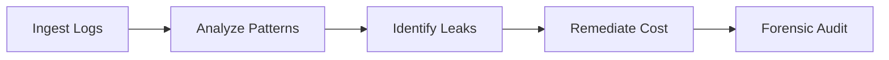

### 3. Data Transfer Cost Heatmap Architecture
Strategic visualization of high-cost traffic paths across regions, availability zones, and cloud providers, highlighting the "hot spots" where data transfer fees are most significant.

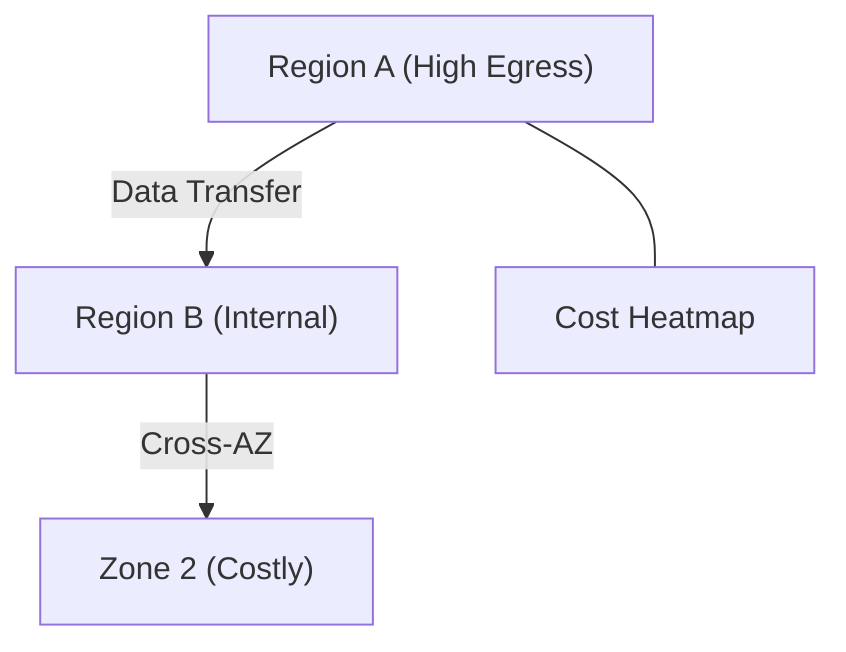

### 4. Internet Egress vs. Private Link Cost Flow
Comparing the financial impact of routing service-to-service traffic over the public internet versus utilizing managed Private Link endpoints or Gateway Endpoints.

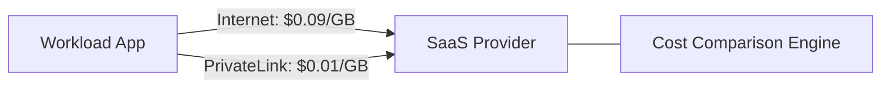

### 5. Unused Resource Detection (NAT/EIP) Flow
Identifying dormant NAT Gateways, static IP addresses, and unattached network interfaces that continue to accrue hourly charges without supporting active traffic.

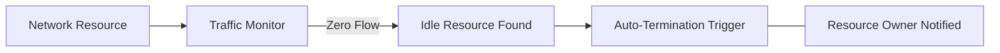

### 6. Inter-AZ Traffic Reduction Strategy
Orchestrating workload placement and service mesh routing policies to minimize data transfer between Availability Zones, reducing the "Inter-AZ Tax."

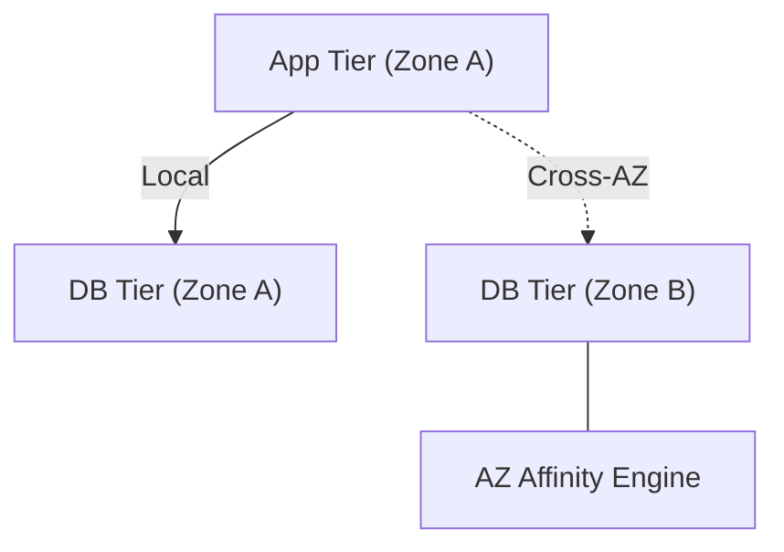

### 7. Institutional Network Cost Scorecard
Grading organizational performance based on key financial indicators: Cost Efficiency Ratio, Budget Adherence, and ROI of Optimization Actions.

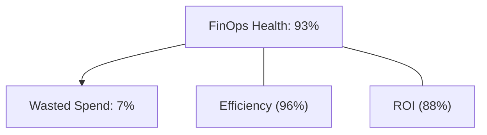

### 8. Identity & RBAC for FinOps Governance
Managing fine-grained access to financial dashboards, cost recommendations, and remediation triggers between FinOps Analysts, Network Architects, and Engineering Leads.

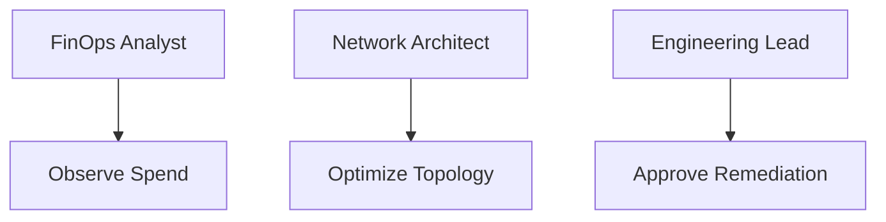

### 9. IaC Deployment: FinOps-as-Code Framework
Using modular Terraform to deploy and manage the versioned distribution of the cost analyzer hubs, flow log processors, and forensic metadata lakes.

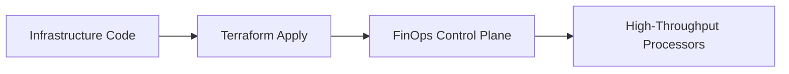

### 10. AIOps Cost Anomaly Detection Flow
Using machine learning to identify sudden spikes in network egress or peering fees, correlating them with deployment events or potential security incidents.

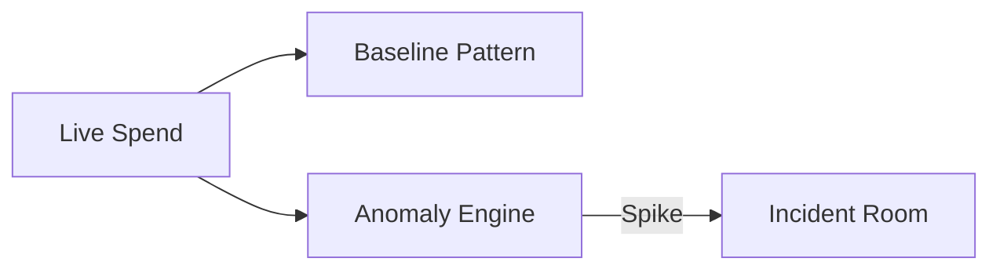

### 11. Metadata Lake for Forensic Cost Audit
Storing long-term records of every network expense, saving event, and optimization decision for institutional record-keeping and audit.

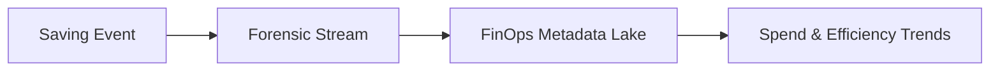

---

## 🏛️ Core FinOps Pillars

1.  **Granular Traffic Attribution**: Mapping byte-level traffic flows to specific business units, teams, and applications.
2.  **Architectural Anti-Pattern Detection**: Automatically identifying inefficient routing (e.g., missing Gateway Endpoints).
3.  **Real-Time Anomaly Detection**: Identifying and alerting on sudden, unexpected spikes in network egress costs.
4.  **Multi-Cloud Cost Normalization**: Centralizing disparate billing schemas into a unified institutional economics model.
5.  **Automated Cost Remediation**: Orchestrating the removal of idle resources and the optimization of traffic paths.
6.  **Full Financial Auditability**: Immutable recording of every network expense and optimization action for institutional forensics.

---

## 🛠️ Technical Stack & Implementation

### FinOps Engine & APIs
*   **Framework**: Python 3.11+ / FastAPI.
*   **Data Engine**: Memory-optimized flow log processing using Pandas and DuckDB.
*   **Recommendation Hub**: Custom engine for identifying NAT Gateway inefficiencies and cross-AZ traffic anti-patterns.
*   **Persistence**: PostgreSQL (Metadata Lake) and Redis (Live Anomaly Cache).
*   **Auth Orchestrator**: Federated OIDC/SAML for least-privilege FinOps access.

### FinOps Dashboard (UI)
*   **Framework**: React 18 / Vite.
*   **Theme**: Dark, Emerald, Slate (Modern high-fidelity financial aesthetic).
*   **Visualization**: Recharts for cost trends, spend heatmaps, and ROI analytics.

### Infrastructure & DevOps
*   **Runtime**: AWS EKS or Azure Kubernetes Service (AKS).
*   **Data Plane**: High-throughput ingestion of VPC Flow Logs and Cloud Billing APIs (CUR/Cost Mgmt).
*   **IaC**: Modular Terraform for deploying the FinOps hub and analyzer distributions.

---

## 🏗️ IaC Mapping (Module Structure)

| Module | Purpose | Real Services |
| :--- | :--- | :--- |
| **`infrastructure/finops_hub`** | Central management plane | EKS, PostgreSQL, Redis |
| **`infrastructure/collectors`** | Billing & Flow collectors | Lambda, S3, Athena |
| **`infrastructure/analysis`** | Cost & Pattern engine | Spark, Flink, Python |
| **`infrastructure/auditing`** | Forensic cost sinks | S3, Athena, Quicksight |

---

## 🚀 Deployment Guide

### Local Principal Environment
```bash
# Clone the FinOps platform
git clone https://github.com/devopstrio/network-cost-optimization.git
cd network-cost-optimization

# Configure environment
cp .env.example .env

# Launch the FinOps stack
make init

# Trigger a mock flow ingestion and cost optimization simulation
make simulate-finops
```

Access the FinOps Dashboard at `http://localhost:3000`.

---

## 📜 License
Distributed under the MIT License. See `LICENSE` for more information.

---
<div align="center">
  <p>© 2026 Devopstrio. All rights reserved.</p>
</div>
