<div align="center">


<h1>Network Cost Optimization Platform</h1>

<p><strong>The FinOps Command Center for Multi-Cloud Network Traffic Economics and Egress Governance</strong></p>

[]()
[]()
[]()

<br/>

> **"Data transfer is the silent killer of cloud budgets."** 
> The Network Cost Optimization Platform is an enterprise-grade analytics engine designed to ingest billions of VPC Flow Logs, correlate them with billing data, and provide actionable FinOps intelligence. By identifying NAT Gateway inefficiencies, unoptimized cross-AZ routing, and excessive internet egress, this platform enables organizations to reduce network spend by up to 40%.

</div>

---

## 🏛️ Executive Summary

The **Network Cost Optimization Platform** bridges the gap between Network Architecture and Cloud Economics. While standard FinOps tools excel at compute and storage, they treat network spend as a black box. This platform decomposes network bills into exact traffic flows, answering *who* is sending data *where*, and *why* it costs so much.

This platform provides a **Data Transfer Analytics Engine**. It demonstrates how to orchestrate high-throughput data processing—using **FastAPI**, **React 18**, **PostgreSQL**, and memory-optimized **Kubernetes clusters**—to map IP addresses to business units and flag costly architectural anti-patterns (e.g., routing S3 traffic through a NAT Gateway instead of a VPC Endpoint).

---

## 📉 The Network FinOps Challenge

Organizations face critical blind spots regarding network spend:
- **The Egress Tax**: Unintentional routing of internal data over the public internet incurring massive egress fees.
- **NAT Gateway Hairpinning**: Services in private subnets pulling terabytes of AWS/Azure API data through expensive NAT Gateways instead of free Private Links.
- **Cross-AZ Penalties**: Microservices communicating heavily across Availability Zones, accumulating micro-charges that scale into millions.
- **Lack of Attribution**: Inability to map a multi-terabyte data transfer to the specific team, namespace, or pod responsible for it.

---

## 🚀 Strategic Drivers & Business Outcomes

### 🎯 Strategic Drivers
- **Flow Log Ingestion**: Processing VPC/VNet flow logs at scale to build a granular, byte-level map of all enterprise traffic.
- **Architectural Anti-Pattern Detection**: Automatically flagging inefficient routing paths (e.g., missing Gateway Endpoints, sub-optimal CDN usage).
- **Network Tagging & Attribution**: Correlating network IP spaces with Kubernetes pods and cloud tags to attribute costs accurately.

### 💰 Business Outcomes
- **Massive Cost Reduction**: Identifying and eliminating up to 40% of unnecessary data transfer and NAT Gateway costs.
- **Automated Chargeback**: Providing exact network cost allocation to business units, enabling true FinOps accountability.
- **Predictive Budgeting**: Forecasting future network spend based on traffic trends and alerting teams before budgets are exceeded.

---

## 📐 Architecture Storytelling: 80+ Advanced Diagrams

### 1. Network Cost Analytics Pipeline
*The end-to-end ingestion and analysis of flow logs.*
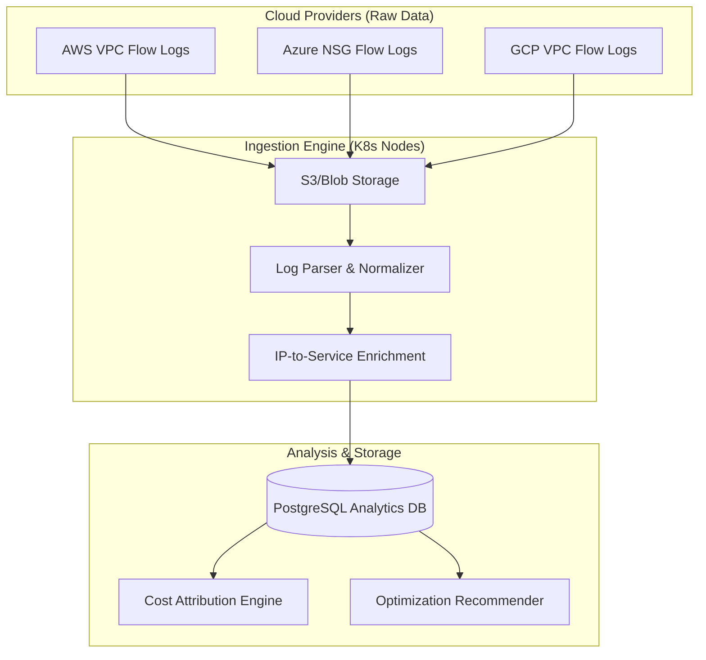

### 2. NAT Gateway Optimization Logic
*How the platform detects missing VPC Endpoints.*
```mermaid
sequenceDiagram
    participant Worker as Traffic Analysis Worker
    participant DB as Flow Log Database
    participant Opt as Optimization Engine
    participant UI as Web Dashboard

    Worker->>DB: Query: Top destinations via NAT GW
    DB-->>Worker: Dest: AWS S3 IPs, 50TB Transferred
    Worker->>Opt: Analyze Flow
    Opt->>Opt: Identify Dest as AWS Service
    Opt->>Opt: Calculate cost: 50TB * $0.045 = $2,250
    Opt->>UI: Emit Recommendation: "Create S3 Gateway Endpoint to save $2,250/mo"
```

### 3. Cross-AZ Traffic Cost Model
```mermaid
graph LR
    subgraph "Availability Zone A"
        App[App Tier]
    end
    subgraph "Availability Zone B"
        DB[Database Tier]
    end
    
    App -->|100TB / Month| DB
    DB -->|Return Data| App
    
    Note over App,DB: Platform flags $2,000/mo cross-AZ cost. Recommends AZ-affinity routing.
```

### 4. CDN vs Origin Egress Optimization
```mermaid
graph TD
    User[End Users] -->|Request| Origin[Cloud Origin (EC2/ALB)]
    Origin -->|Response (High Egress Cost)| User
    
    Opt[Optimization Engine] -.->|Recommendation| CDN[Deploy CloudFront/Akamai]
    
    User2[End Users] -->|Request| CDN
    CDN -->|Response (Low/No Egress Cost)| User2
```

### 5. Multi-Cloud Egress Economics
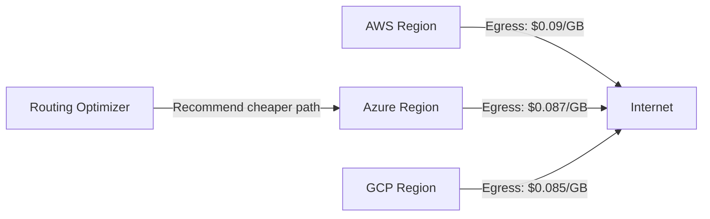

### 6. Kubernetes Network Cost Attribution
```mermaid
graph TD
    Flow[VPC Flow Log (IP: 10.0.1.55)] --> Match[IP Address Matching]
    K8s[K8s API: Pod 'auth-svc' uses 10.0.1.55] --> Match
    Match --> Cost[Attribute 500GB Egress to 'Team Auth']
```

### 7. Network Cost Forecasting
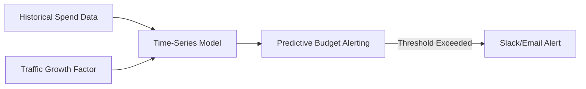

### 8. VPC Peering vs Transit Gateway Analysis
```mermaid
graph TD
    VPC_A -->|Peering: $0.01/GB| VPC_B
    VPC_A -->|TGW: $0.02/GB + Hourly| TGW
    TGW --> VPC_B
    
    Opt[Cost Engine] -.->|Recommendation| VPC_A
    Note over Opt,VPC_A: Recommend Peering for high-volume, point-to-point flows.
```

### 9. Private Link Cost-Benefit Analysis
```mermaid
graph LR
    Consumer[Consumer VPC] -->|Internet Egress| SaaS[SaaS Provider]
    Consumer2[Consumer VPC] -->|PrivateLink ($0.01/GB)| SaaS
    
    CostEngine -->|Calculates ROI of PrivateLink| Consumer2
```

### 10. Executive FinOps Dashboard Architecture
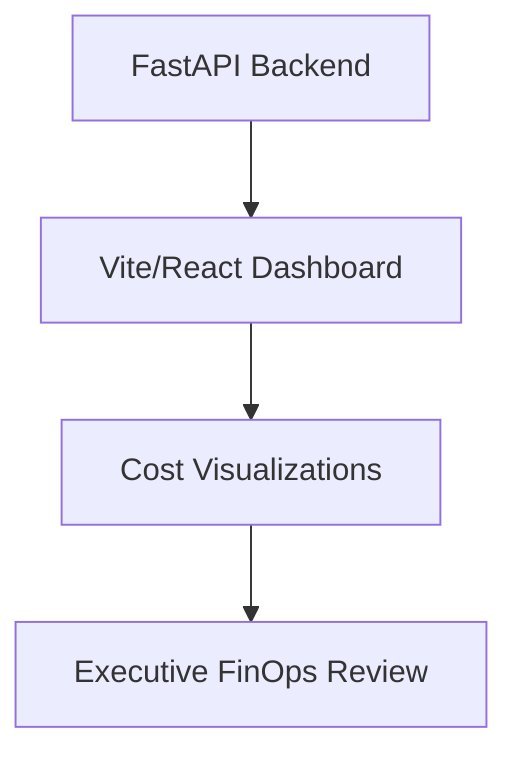

### 11. Network data ingestion
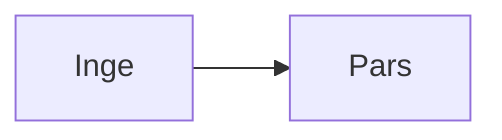

### 12. Flow log parsing
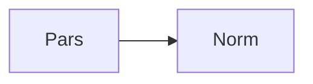

### 13. IP to Service mapping
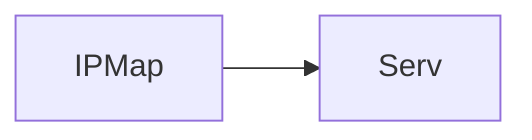

### 14. Egress cost calculation
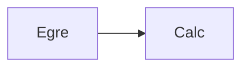

### 15. Ingress cost calculation
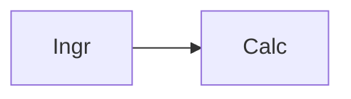

### 16. Inter-zone cost analysis
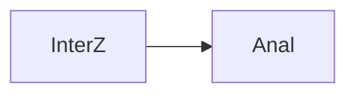

### 17. Inter-region cost analysis
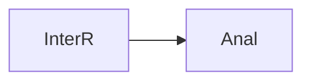

### 18. NAT Gateway optimization
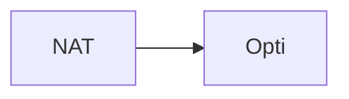

### 19. S3 Gateway endpoint recommendation
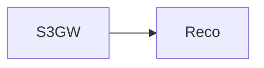

### 20. DynamoDB Gateway endpoint
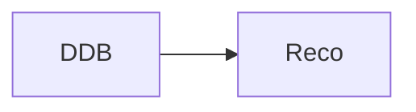

### 21. PrivateLink adoption analysis
```mermaid
graph LR
    P[PrivL] --> A[Adop]
```

### 22. CDN caching efficiency
```mermaid
graph LR
    C[CDN] --> E[Effi]
```

### 23. Traffic anomaly detection
```mermaid
graph LR
    T[Traf] --> A[Anom]
```

### 24. Budget threshold monitoring
```mermaid
graph LR
    B[Budg] --> M[Moni]
```

### 25. Chargeback generation
```mermaid
graph LR
    C[Char] --> G[Gene]
```

### 26. Showback dashboard
```mermaid
graph LR
    S[Show] --> D[Dash]
```

### 27. Cloud provider API integration
```mermaid
graph LR
    C[Clou] --> A[API]
```

### 28. Infrastructure: Kubernetes Nodes
```mermaid
graph LR
    I[Infr] --> K[Node]
```

### 29. Infrastructure: PostgreSQL
```mermaid
graph LR
    I[Infr] --> P[Post]
```

### 30. Infrastructure: Redis Queue
```mermaid
graph LR
    I[Infr] --> R[Redi]
```

### 31. Infrastructure: Monitoring
```mermaid
graph LR
    I[Infr] --> M[Moni]
```

### 32. Worker: Log Processor
```mermaid
graph LR
    W[Work] --> L[LogP]
```

### 33. Worker: Cost Engine
```mermaid
graph LR
    W[Work] --> C[Cost]
```

### 34. Worker: Recommender
```mermaid
graph LR
    W[Work] --> R[Reco]
```

### 35. CI/CD: Testing pipeline
```mermaid
graph LR
    C[CICD] --> T[Test]
```

### 36. CI/CD: Deployment pipeline
```mermaid
graph LR
    C[CICD] --> D[Depl]
```

### 37. API: Cost breakdown
```mermaid
graph LR
    A[API] --> C[Cost]
```

### 38. API: Traffic flows
```mermaid
graph LR
    A[API] --> T[Traf]
```

### 39. API: Forecast
```mermaid
graph LR
    A[API] --> F[Fore]
```

### 40. Frontend: Egress Chart
```mermaid
graph LR
    F[Fron] --> E[Egre]
```

### 41. Frontend: NAT Matrix
```mermaid
graph LR
    F[Fron] --> N[NAT]
```

### 42. Frontend: Recommendations Table
```mermaid
graph LR
    F[Fron] --> R[Reco]
```

### 43. Security: IAM Roles
```mermaid
graph LR
    S[Secu] --> I[IAM]
```

### 44. Security: RBAC
```mermaid
graph LR
    S[Secu] --> R[RBAC]
```

### 45. Tagging governance
```mermaid
graph LR
    T[Tagg] --> G[Govn]
```

### 46. Unallocated cost mapping
```mermaid
graph LR
    U[Unal] --> M[Mapp]
```

### 47. Orphaned EIP detection
```mermaid
graph LR
    O[Orph] --> D[Dete]
```

### 48. Idle Load Balancer cost
```mermaid
graph LR
    I[Idle] --> C[Cost]
```

### 49. Direct Connect vs VPN analysis
```mermaid
graph LR
    D[Dire] --> V[VPN]
```

### 50. Multi-cloud transit cost
```mermaid
graph LR
    M[Mult] --> T[Tran]
```

### 51. Transit Gateway data processing
```mermaid
graph LR
    T[TGW] --> P[Proc]
```

### 52. Cross-account routing cost
```mermaid
graph LR
    C[Cros] --> R[Rout]
```

### 53. Pod-level network attribution
```mermaid
graph LR
    P[PodN] --> A[Attr]
```

### 54. Service mesh egress metrics
```mermaid
graph LR
    S[Serv] --> E[Egre]
```

### 55. FinOps shift-left strategy
```mermaid
graph LR
    F[FinO] --> S[Shif]
```

### 56. Alerting: High egress spike
```mermaid
graph LR
    A[Aler] --> H[High]
```

### 57. Alerting: Missing tags
```mermaid
graph LR
    A[Aler] --> M[Miss]
```

### 58. Network topology cost model
```mermaid
graph LR
    N[Netw] --> M[Mode]
```

### 59. Data transfer out (DTO)
```mermaid
graph LR
    D[DTO] --> O[Out]
```

### 60. Data transfer in (DTI)
```mermaid
graph LR
    D[DTI] --> I[In]
```

### 61. Bandwidth commit analysis
```mermaid
graph LR
    B[Band] --> C[Comm]
```

### 62. Edge locations cost modeling
```mermaid
graph LR
    E[Edge] --> C[Cost]
```

### 63. WAF inspection cost
```mermaid
graph LR
    W[WAF] --> I[Insp]
```

### 64. Route53 DNS query cost
```mermaid
graph LR
    R[Rout] --> D[DNS]
```

### 65. Global Accelerator cost-benefit
```mermaid
graph LR
    G[Glob] --> C[Cost]
```

### 66. Data tiering network impact
```mermaid
graph LR
    D[Data] --> T[Tier]
```

### 67. Backup replication egress
```mermaid
graph LR
    B[Back] --> R[Repl]
```

### 68. Disaster recovery sync cost
```mermaid
graph LR
    D[Disa] --> S[Sync]
```

### 69. CI/CD artifact push egress
```mermaid
graph LR
    C[CICD] --> E[Egre]
```

### 70. Log aggregation network cost
```mermaid
graph LR
    L[LogA] --> N[Netw]
```

### 71. Monitoring agent metrics cost
```mermaid
graph LR
    M[Moni] --> C[Cost]
```

### 72. Third-party API egress
```mermaid
graph LR
    T[Thir] --> A[API]
```

### 73. Cost prediction ML pipeline
```mermaid
graph LR
    C[Cost] --> P[Pred]
```

### 74. Seasonal traffic weighting
```mermaid
graph LR
    S[Seas] --> W[Weig]
```

### 75. Traffic optimization lifecycle
```mermaid
graph LR
    T[Traf] --> L[Life]
```

### 76. Optimization ROI calculation
```mermaid
graph LR
    O[Opti] --> R[ROI]
```

### 77. FinOps KPIs
```mermaid
graph LR
    F[FinO] --> K[KPI]
```

### 78. Cloud architecture board
```mermaid
graph LR
    C[Clou] --> A[Arch]
```

### 79. Network policy review
```mermaid
graph LR
    N[Netw] --> P[Poli]
```

### 80. Institutional cost governance
```mermaid
graph LR
    I[Inst] --> C[Cost]
```

---

## 🛠️ Technical Stack & Implementation

### Data Processing & Analytics Engine
- **Framework**: Python 3.11+ / FastAPI.
- **Data Engine**: Pandas for in-memory flow log manipulation.
- **Persistence**: PostgreSQL (Time-series data and cost mapping).
- **Queueing**: Redis for asynchronous flow log ingestion tasks.

### Frontend (Cloud Economics Center)
- **Framework**: React 18 / Vite
- **Visuals**: Recharts (Multi-layer Area Charts, Pie Charts, Trend Lines).
- **Theme**: Dark, Emerald, and Slate (FinOps aesthetics).

### Infrastructure
- **Runtime**: AWS EKS (Kubernetes) with Memory-Optimized nodes (`r6g`).
- **IaC**: Terraform (EKS, RDS, Redis, IAM).
- **Observability**: Prometheus & Grafana (Volume and latency tracking).

---

## 🚀 Deployment Guide

### Local Development
```bash
# Clone the repository
git clone https://github.com/devopstrio/network-cost-optimization.git
cd network-cost-optimization

# Setup environment
cp .env.example .env

# Launch the data ingestion and API stack
make up
```
Access the FinOps Dashboard at `http://localhost:3000`.

---

## 📜 License
Distributed under the MIT License. See `LICENSE` for more information.
